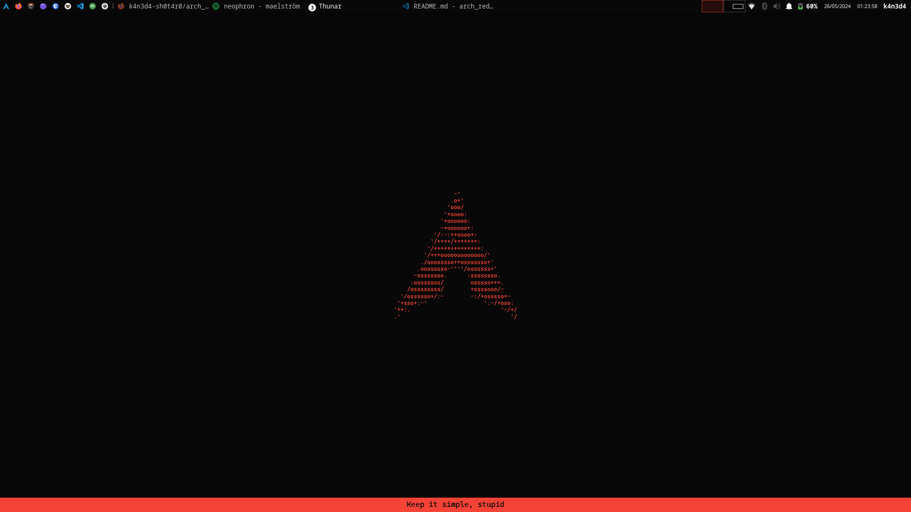
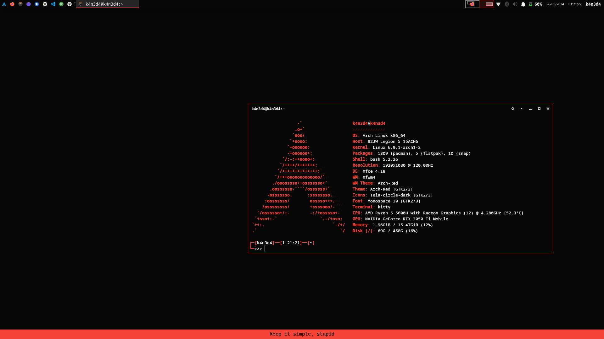
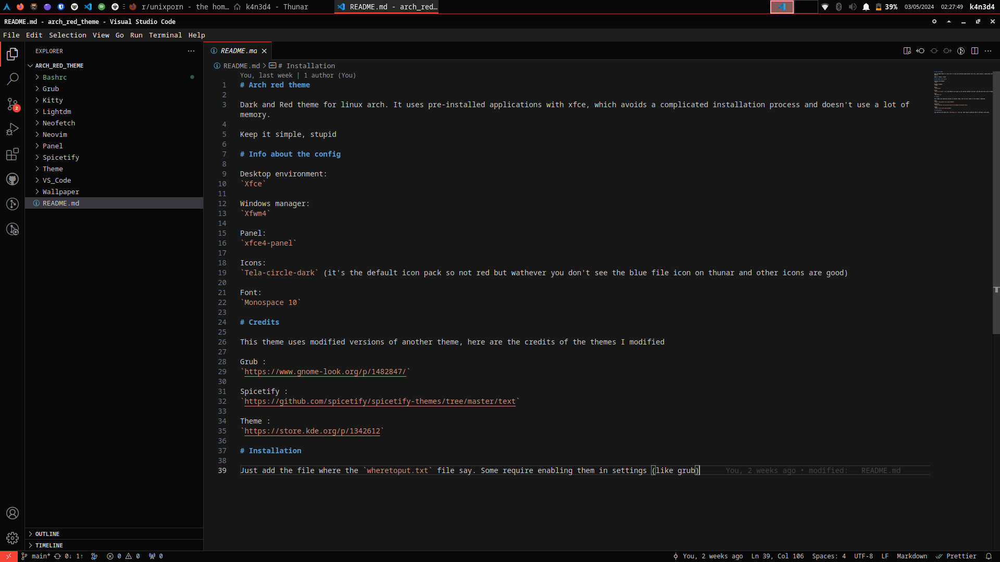
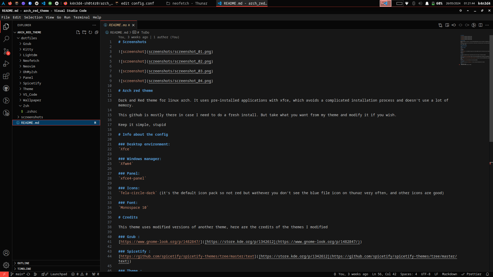
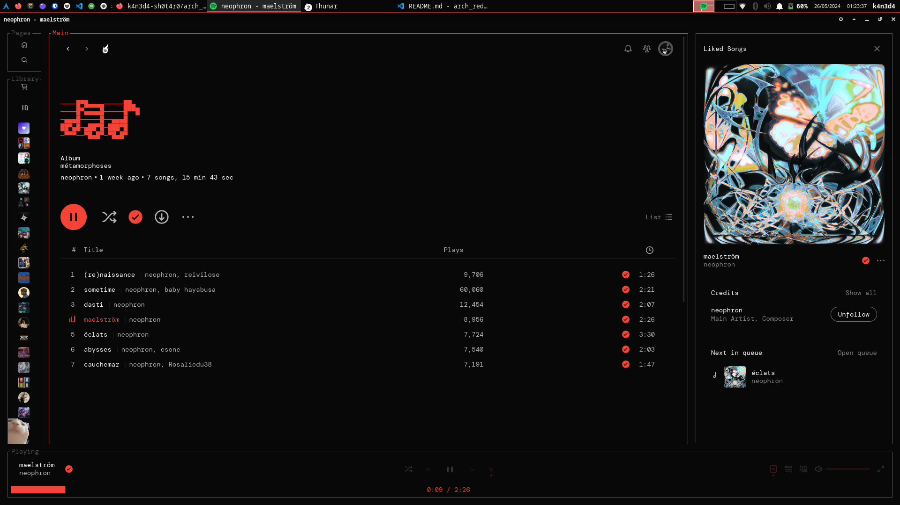

# Screenshots

# Arch red theme

Dark and Red theme for linux arch. It uses pre-installed applications with xfce, which avoids a complicated installation process and doesn't use a lot of memory.

This github is mostly there in case I need to do a fresh install. But take what you want from my theme and modify it if you wish.

Keep it simple, stupid

# Info about the config

### Desktop environment:
`Xfce`

### Windows manager:
`Xfwm4`

### Panel:
`xfce4-panel`

### Icons:
`Tela-circle-red-dark` (In case I put a 7z archive with the icon pack)

### Font:
`Monospace 10`

# Credits

This theme uses modified versions of another theme, here are the credits of the themes I modified

### Theme :
[https://store.kde.org/p/1342612](https://store.kde.org/p/1342612)

### Grub :
[https://www.gnome-look.org/p/1482847/]([https://store.kde.org/p/1342612](https://www.gnome-look.org/p/1482847/))

### Spicetify :
[https://github.com/spicetify/spicetify-themes/tree/master/text]([https://store.kde.org/p/1342612](https://github.com/spicetify/spicetify-themes/tree/master/text))

# Installation

Just add the file where the `wheretoput.txt` file say. Some require enabling them in settings

# ToDo

* Add different colors
* Change icons theme to match color theme

# Additional info

In the screenshots, don't pay attention to the shell line in neofetch, I don't know why but neofetch says I'm using bash as a shell when I'm using zsh with OhMyZsh. I haven't looked into the reason for this bug yet.