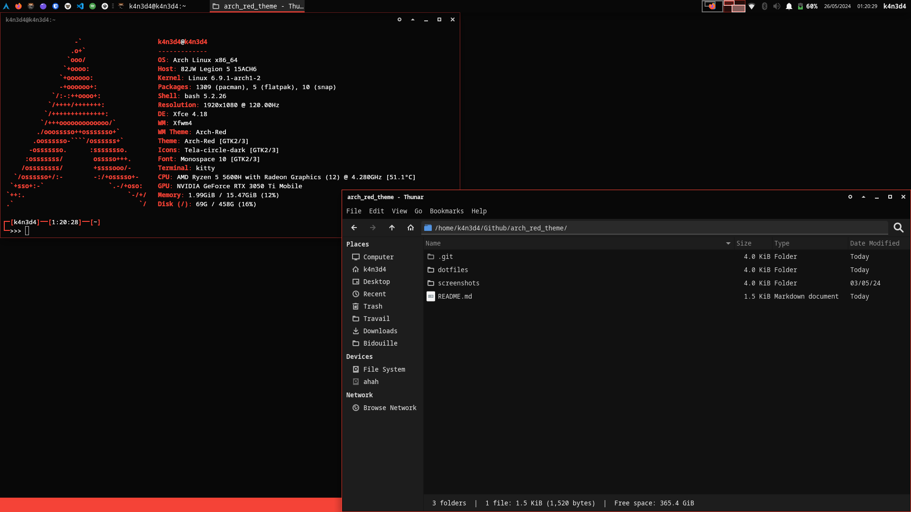

# Screenshots

# Arch red theme

Dark and Red theme for linux arch. It uses pre-installed applications with xfce, which avoids a complicated installation process and doesn't use a lot of memory.

Keep it simple, stupid

# Info about the config

Desktop environment:
`Xfce`

Windows manager:
`Xfwm4`

Panel:
`xfce4-panel`

Icons:
`Tela-circle-dark` (it's the default icon pack so not red but wathever you don't see the blue file icon on thunar very often, and other icons are good)

Font:
`Monospace 10`

# Credits

This theme uses modified versions of another theme, here are the credits of the themes I modified

Grub :
`https://www.gnome-look.org/p/1482847/`

Spicetify :
`https://github.com/spicetify/spicetify-themes/tree/master/text`

Theme :
`https://store.kde.org/p/1342612`

# Installation

Just add the file where the `wheretoput.txt` file say. Some require enabling them in settings (like grub)